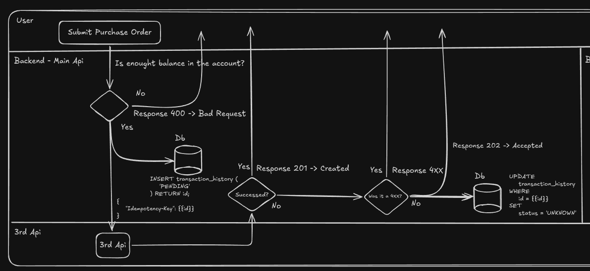
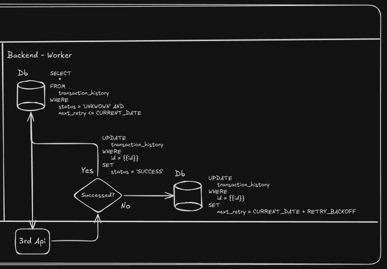

When a platform sends a stock-purchase request to a broker API, it cannot know what happened merely because the connection ends badly. The broker may have received and executed the order before the response timed out. This design makes one synchronous attempt, records its outcome, and uses PostgreSQL to reconcile uncertain transactions in the background.

The important boundary is between a response received from the broker and no response received. When the broker returns a response, the platform preserves the normal behavior: it stores the outcome and returns the broker's `2xx` or `4xx` result to its client. A timeout, a server-closed socket, or a `5xx` response is not treated as a failed purchase. It is treated as an `UNKNOWN` purchase that must be reconciled.

## Persist the purchase before the first attempt

Create a transaction record before calling the broker. The simplified table in this example has the fields needed to schedule the reconciliation queue. PostgreSQL uses `timestamptz` rather than `DATETIME`; an explicit UUID default also needs a UUID generator to be available.

```sql {filename="db/migrations/001_transaction_history.sql",linenos=false}
CREATE EXTENSION IF NOT EXISTS pgcrypto;

CREATE TABLE transaction_history (
  id UUID PRIMARY KEY DEFAULT gen_random_uuid(),
  status VARCHAR(30) NOT NULL,
  next_retry TIMESTAMPTZ
);

CREATE INDEX transaction_history_unknown_retry_idx
  ON transaction_history (next_retry)
  WHERE status = 'UNKNOWN';
```

In a production purchase flow, the record also needs the broker request or a reference to it, the broker's operation ID, an idempotency key, an attempt count, and timestamps. Without the original request and a stable idempotency key, a worker cannot safely reproduce the purchase. Keep sensitive order details protected according to the platform's data-handling requirements.

The request handler begins by inserting `PENDING`. This establishes a durable transaction ID before the outgoing call begins.

```sql {filename="internal/purchases/repository.sql",linenos=false}
INSERT INTO transaction_history (status)
VALUES ('PENDING')
RETURNING id;
```

## Make exactly one synchronous broker call

The client-facing path attempts the broker request once. It must have a deadline so a stuck connection does not exhaust all request workers. Pass the transaction's idempotency key with the request, using the same key in every later reconciliation attempt.



The diagram shows the synchronous boundary: a rejected balance check returns `400 Bad Request` without contacting the broker; an accepted purchase is recorded as `PENDING` before the one broker call; and an ambiguous result is persisted as `UNKNOWN` before the platform returns `202 Accepted`.

```text {linenos=false}
create transaction: PENDING
        |
        v
one POST to the broker API with an idempotency key
        |
        +-- response received (2xx or 4xx) --> persist final result --> return it to client
        |
        +-- timeout, closed socket, or 5xx --> persist UNKNOWN --> schedule retry
```

For any returned `2xx` or `4xx`, update the row with the terminal outcome and return that response to the client. A `4xx` is a known broker rejection, so it does not belong in the retry queue. The precise terminal status names are an application choice; `COMPLETED` and `REJECTED` are used here.

```sql {filename="internal/purchases/repository.sql",linenos=false}
UPDATE transaction_history
SET status = 'COMPLETED', next_retry = NULL
WHERE id = $1;

UPDATE transaction_history
SET status = 'REJECTED', next_retry = NULL
WHERE id = $1;
```

If the first call times out, the server closes the socket, or it returns a `5xx`, set `UNKNOWN` and make it eligible for background work. A `5xx` can still be ambiguous: a broker may have committed the order before its server produced the error.

```sql {filename="internal/purchases/repository.sql",linenos=false}
UPDATE transaction_history
SET status = 'UNKNOWN', next_retry = CURRENT_TIMESTAMP
WHERE id = $1;
```

The synchronous response for this branch must not claim the stock was bought. One option is `202 Accepted` with the transaction ID and a `pending_reconciliation` status. The client can then poll a transaction-status endpoint or receive a later notification.

## Reconcile unknown purchases with a worker

A separate worker continuously finds due rows: `status = 'UNKNOWN'` and `next_retry <= CURRENT_TIMESTAMP`. Multiple worker instances must not pick the same transaction. PostgreSQL row locking with `FOR UPDATE SKIP LOCKED` lets each instance claim a different row without waiting behind another worker.



The worker diagram represents one reconciliation pass. The production query below strengthens it by claiming rows with `FOR UPDATE SKIP LOCKED` and moving `next_retry` forward before the network call, which prevents two worker instances from processing the same purchase concurrently.

```sql {filename="internal/purchases/claim_due_transactions.sql",linenos=false}
WITH due AS (
  SELECT id
  FROM transaction_history
  WHERE status = 'UNKNOWN'
    AND next_retry <= CURRENT_TIMESTAMP
  ORDER BY next_retry
  FOR UPDATE SKIP LOCKED
  LIMIT 50
)
UPDATE transaction_history AS transactions
SET next_retry = CURRENT_TIMESTAMP + INTERVAL '5 minutes'
FROM due
WHERE transactions.id = due.id
RETURNING transactions.id;
```

The query claims a small batch by pushing `next_retry` forward inside a short database transaction. Commit before calling the broker. Holding a database row lock during a network call keeps locks open for an unbounded time and prevents other workers from recovering if the process dies.

For each claimed transaction, the worker should first use the broker's operation lookup endpoint when it exists. A confirmed broker result updates the local record to `COMPLETED` or `REJECTED`. If lookup cannot determine the result, the worker retries the purchase with the original idempotency key. That key is what allows the broker to return the original outcome rather than make a second purchase.

```text {linenos=false}
UNKNOWN and due
  -> claim row
  -> look up broker operation
       -> known result: persist COMPLETED or REJECTED
       -> still unknown: retry with the original idempotency key
            -> response received: persist final result
            -> timeout, closed socket, or 5xx: keep UNKNOWN and defer again
```

## Schedule bounded exponential backoff

On another uncertain response, leave the row as `UNKNOWN` and advance `next_retry` with exponential backoff plus random jitter. The worker continues to select only rows whose retry time is due; it does not repeatedly call the broker while `next_retry` is in the future.

```sql {filename="internal/purchases/repository.sql",linenos=false}
UPDATE transaction_history
SET status = 'UNKNOWN',
    next_retry = CURRENT_TIMESTAMP + $2::interval
WHERE id = $1;
```

For example, a retry plan might use one minute, two minutes, four minutes, then a capped delay, with jitter applied to each wait. It also needs a maximum number of attempts or a maximum reconciliation age. When that limit is reached, move the transaction to a terminal `MANUAL_REVIEW` state and alert an operator rather than retrying forever.

## Make the client outcome honest

The platform has three client-visible outcomes:

| Broker result | Stored status | Client response |
| --- | --- | --- |
| Broker returns `2xx` | `COMPLETED` | Return the broker's success response |
| Broker returns `4xx` | `REJECTED` | Return the broker's client-error response |
| Timeout, closed socket, or `5xx` | `UNKNOWN` | Return `202 Accepted` with the transaction ID |

This design does not promise exactly-once execution over an unreliable network. It makes the uncertainty explicit, preserves the data needed to resolve it, and ensures that only the reconciliation worker revisits an ambiguous broker purchase. Track unknown queue depth, oldest due retry, retries, and transactions sent to manual review so an outage is visible before delayed purchases become a customer-facing problem.
